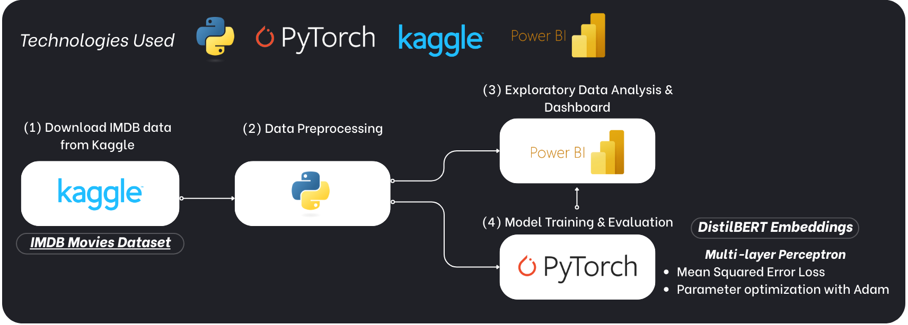

# Analysis on IMDB

This is a group final project on Business Intelligence. In this project, we aimed to develop a solution for the movie industry where one can gain insights through our dashboard designed using PowerBI. Furthermore, we also built a Deep Learning model that can be used to predict the IMDB rating of upcoming movies.

## The IMDB dataset
The dataset we opt for can be downloaded from [Kaggle](https://www.kaggle.com/datasets/harshitshankhdhar/imdb-dataset-of-top-1000-movies-and-tv-shows?fbclid=IwY2xjawKepCRleHRuA2FlbQIxMQABHo-rim0MB2nMB5GryjKnh_QeNDkBJ2Xah89jzpYkvlacbWJWN1sxy9JwQTXz_aem_scllb0m8wJsEcT61U-dH3g). The dataset contains various information about movies including rich features like movie description and movie poster.

## Overall Workflow

Our workflow consists of three main stages:
- Preprocessing: We preprocessed the data by checking and removing missing data, cleaning incorrectly formatted data as well as feature engineering for our model training.
- Exploratory Data Anlysis: We used PowerBI to build interactively Dashboard with multiple graphs that show information about popular movies as well as different relationships between each feature.
- Model training: We used PyTorch to train a Multi-Layer Perceptron model for predicting the IMDB rating of a movie given its runtime, director, description and genre. Because the rating is bounded between 0 and 10, we opted for a Tanh activation on the output of network to bound the values between -1 and 1 and then scale this output accordingly.

---
### Our contributors

